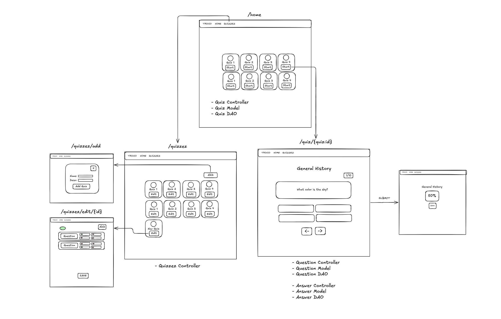
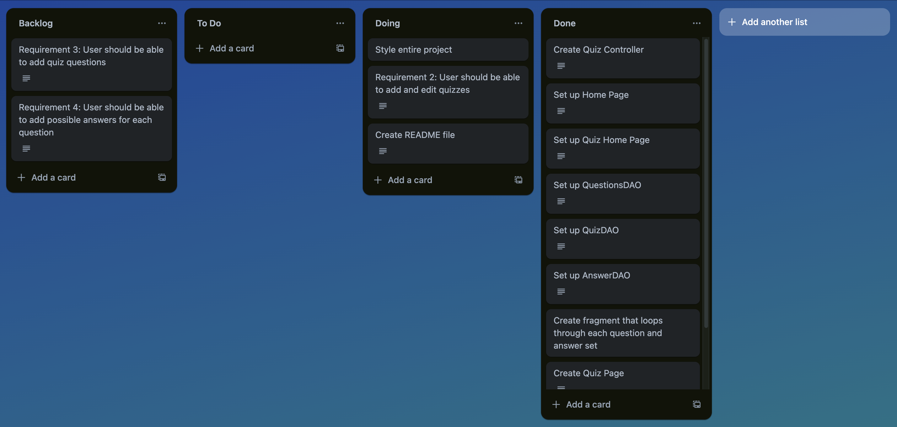

# Trivio Quiz Application

**Description:** 
Trivio Quiz Application is a fun and interactive platform for creating, customizing, and taking quizzes with ease.


---

## Table of Contents

1. [Technologies](#technologies)
2. [Installation](#installation)
3. [Introduction](#introduction)
4. [Key Aspects of the Project](#key-aspects-of-the-project)
5. [Project Overview](#project-overview)
6. [Development Process](#development-process)
7. [Critical Learning Points](#critical-learning-points)
8. [Code Showcase](#code-showcase)

---
## Technologies


## Installation

To set up and run this project locally, follow these steps:

### 1. Prerequisites

- Ensure you have [Java JDK 11](https://www.oracle.com/java/technologies/javase-jdk11-downloads.html) or later installed.
- Ensure you have [Maven](https://maven.apache.org/install.html) installed.
- Ensure you have [MySQL](https://dev.mysql.com/downloads/) installed and running.

### 2. Clone the Repository

First, clone the project repository from GitHub:

```bash
git clone https://github.com/full-stack-devs-learn/niantic-2024-sprint-2-team-6.git
cd your-repository
```

## Introduction

This project was developed as part of a collaborative effort between [Roxy](https://github.com/roxyabedi) and [Jordan](https://github.com/jordannapoleon) over a four-day pair programming session. Throughout a two-week sprint during the Niantic Voyager Program, we focused on a variety of technical topics and skills. Our learning journey included unit testing, object-oriented analysis and design (OOAD) with inheritance, Java streams, collections, and advanced database management techniques such as aggregates, group by, having, joins, subqueries, and database design. We also explored JavaScript event handling and worked with Thymeleaf and Spring Boot. The primary objective was to deepen our understanding and enhance our proficiency in these areas through practical application and collaboration.


## Key Aspects of the Project

- **Collaborative Development:**  
  The project was a shared endeavor where all team members actively contributed their expertise and insights. This collaborative approach enabled us to tackle complex problems together and integrate our individual strengths into the project.

- **Effective Planning:**  
  We engaged in thorough planning to ensure a structured approach. By clearly defining our goals, dividing tasks based on skills, and setting milestones, we were able to manage our time efficiently and meet our objectives.

- **Clear Communication:**  
  Open and effective communication was fundamental to our success. Regular discussions, updates, and feedback loops allowed us to stay aligned, address issues promptly, and ensure that all contributors were on the same page.

- **Collaborative Decision-Making:**  
  Decision-making was a joint process, with input from all team members contributing to choices and solutions. This collaborative decision-making process helped us achieve well-rounded solutions and incorporate diverse perspectives into our project.

## Project Overview

The project is a quiz application designed using an MVC model with Spring Boot and Thymeleaf. The application leverages JavaScript event listeners for dynamic user interaction and Thymeleaf fragments for modular and reusable HTML components. This approach ensures a seamless and engaging user experience while maintaining a clean and maintainable codebase.

---

This project demonstrates our ability to effectively apply Sprint 2 concepts in a practical application. By integrating event listeners and Thymeleaf fragments, we were able to enhance both the functionality and user experience of our quiz app, showcasing our skills in development, user interaction, and efficient use of modern web technologies.


#### Development Process

Our development process was methodical and collaborative, aimed at ensuring a well-structured and functional quiz application. Here’s a detailed overview of our approach:

1. **Planning and Design:**
   - **Initial Diagrams:** We began by creating diagrams to visualize our initial thoughts and architecture for the quiz application. These diagrams helped us map out the structure of the application, including the MVC model components and user interactions. We used these diagrams to ensure a clear understanding of the project requirements and design before diving into development.
   - **Sketching Menus and User Flow:** A significant portion of our planning involved sketching out the user interface menus and documenting various data elements needed for the application. We carefully considered how users would interact with the app, ensuring that the navigation and functionality were intuitive and user-friendly.

2. **Task Management:**
   - **Trello Board:** To manage our tasks efficiently, we utilized Trello. We created a board to track the progress of different features and tasks, from initial setup and development to testing and final touches. This tool helped us maintain a clear overview of our workflow, assign responsibilities, and monitor deadlines.

3. **Documentation:**
   - **Data and Functionality Documentation:** We documented the data requirements and functionalities in detail, which included defining the data models, possible user inputs, and expected outputs. This documentation served as a reference throughout the development process to ensure consistency and completeness.

We’ve included screenshots of our design diagrams and Trello board to provide a visual representation of our workflow and planning process.

## Design Diagrams


## Trello Board


### Critical Learning Points

#### 1. DataSource Configuration for DAOs

**Problem:**  
Encountered issues with DataSource configuration when creating new instances of DAOs. Initially, the code was modified to allow DAOs to be instantiated without input parameters. This approach led to security concerns, as sensitive database credentials were exposed in the code, and functionality issues arose due to incorrect initialization.

**Approach:**  
Initially attempted to simplify DAO instantiation by removing parameters, but this exposed sensitive information and caused functional problems. Realized that this approach was not viable due to security risks and the improper functioning of DAOs.

**Solution:**  
Reverted to using the original code setup with Spring’s `@Autowired` annotation for dependency injection. This solution ensured proper initialization of DAOs with the DataSource configuration while keeping database credentials secure and not hardcoded into the application code.

#### 2. Handling Promises with Enumerable Objects

**Problem:**  
Faced challenges with enumerable objects when using methods like `Object.keys()`, `Object.values()`, and `for...in` loops with the `getAnswers()` function. The core issue was that the `getAnswers()` function returned a promise, which required proper handling to ensure that data was fully loaded and parsed before performing operations to get the length or iterate over the results.

**Approach:**  
Initially attempted to use enumerable methods and loops directly on the result of `getAnswers()`. However, since `getAnswers()` returned a promise, these methods were not effective until the promise was resolved. This necessitated adjustments to handle asynchronous operations properly.

**Solution:**  
Implemented proper handling of promises by using `async/await` syntax to ensure that the data was fully loaded and parsed before accessing its length or iterating over it. This approach allowed for correct and reliable operations on the data returned from `getAnswers()`, resolving issues related to timing and data readiness.

#### 3. Client-Side Validation Feedback

**Problem:**  
Experienced issues with client-side validation feedback not being displayed to users. Although server-side validation was functioning correctly and new quizzes were not being submitted to the database if invalid, there was no visual feedback indicating validation errors. The problem was due to improper use of Bootstrap's validation classes and form submission methods.

**Approach:**  
Initially, the `was-validated` class was not applied correctly, and the Bootstrap framework was not adding `is-valid` or `is-invalid` classes as expected. This was compounded by using `.submit()` for form submission, which bypassed Bootstrap’s validation handling.

**Solution:**  
Revised the approach to use `.requestSubmit()` instead of `.submit()`. The `requestSubmit()` method triggers form validation and allows Bootstrap to automatically apply the `is-valid` or `is-invalid` classes based on the form's validation status. Additionally, ensured that the `was-validated` class was properly applied to provide visual feedback on the form's validation state, resulting in accurate client-side feedback for users.

### Code Showcase

#### Roxy's favorite block of code

**Code:**
```java
@GetMapping("/quiz/setup/{quizId}")
public String getQuizFragment(Model model, @PathVariable int quizId, @RequestParam int currentQuestion){

    var questions = questionDao.getQuestionsByQuizId(quizId);

    var activeQuestion = questions.stream()
            .filter(question -> question.getQuestionNumber() == currentQuestion)
            .findFirst();

    if (activeQuestion.isPresent())
    {
        var question = activeQuestion.get().getQuestionText();
        var questionId = activeQuestion.get().getQuestionId();
        var answers = answerDao.getAnswersByQuestionId(questionId);

        model.addAttribute("activeQuestion", question);
        model.addAttribute("answers", answers);
    }
    else {
        model.addAttribute("questionNumber", new Quiz());
    }

    return "/fragments/quiz-question";
}
```
#### Jordan's favorite block of code

**Code:**
```javascript
function userAnswerSelected()
{
  const questionParent = document.getElementById("question-answers")
  const questionChildren = questionParent.querySelectorAll("button")
  const rightButton = document.querySelector("#right-button")

  for(let i = 0; i < questionChildren.length; i++)
  {
      const child = questionChildren[i]
      if(child.innerText == userChoices[questionCount])
      {
          child.classList.add("btn-primary")
          child.classList.remove("btn-outline-primary")
          rightButton.disabled = false
          break
      }
  }
}
```
